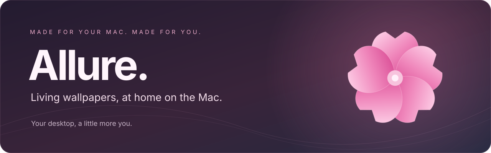
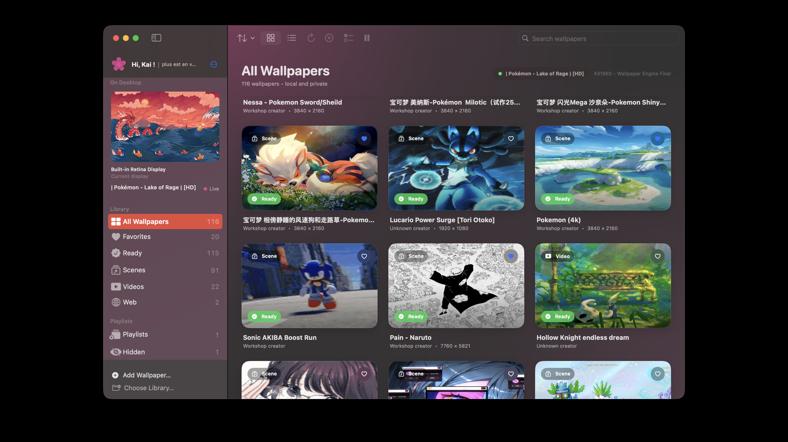
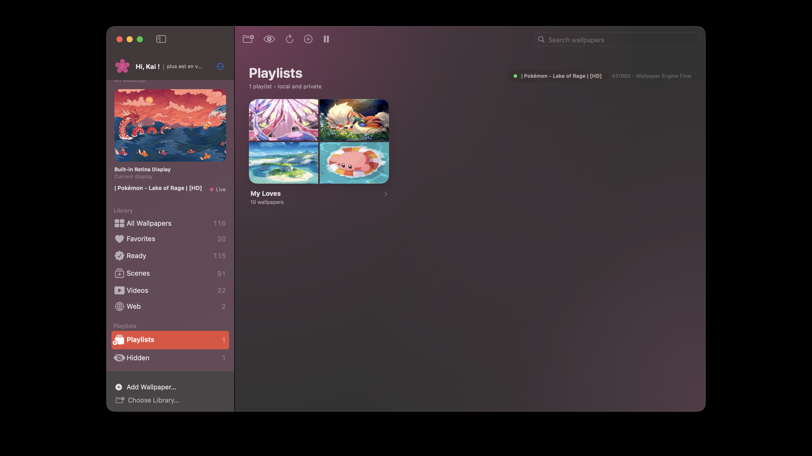
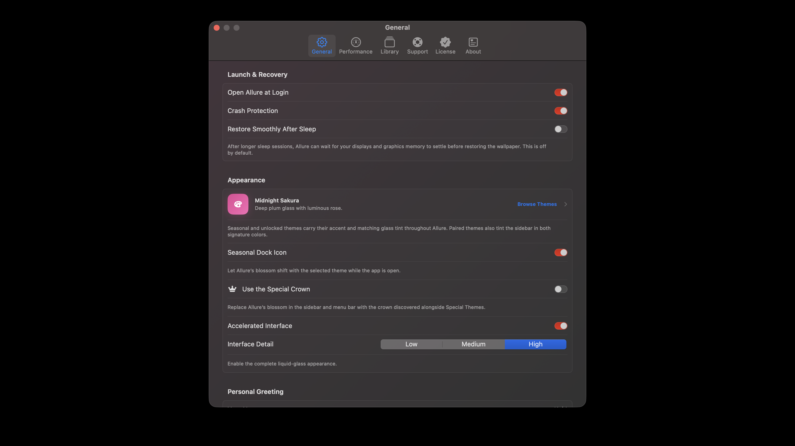
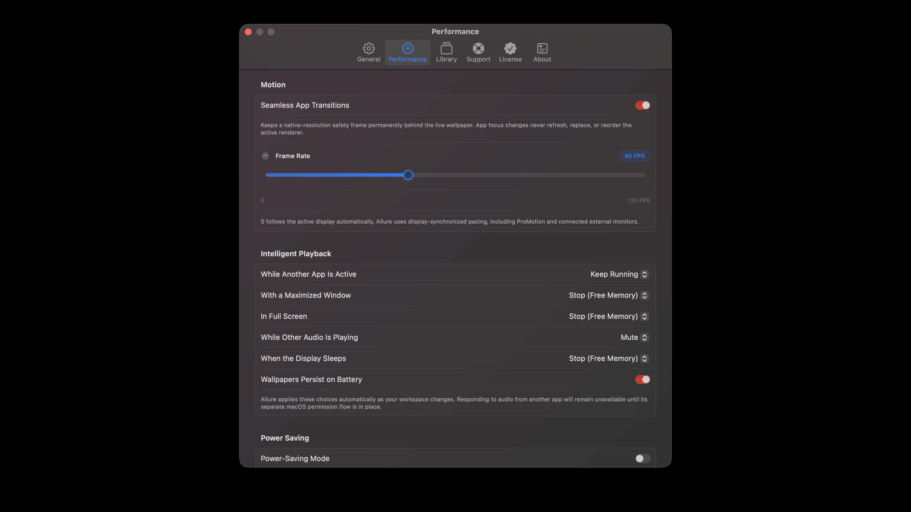
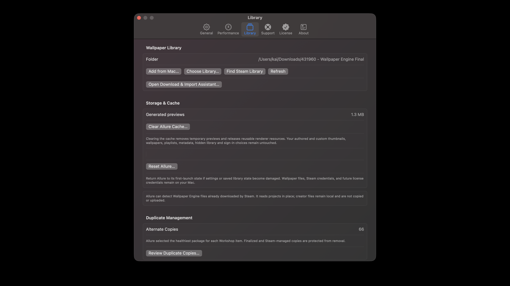

<strong>A desktop worth coming back to.</strong> Native living wallpapers, personal soundtracks, and a little room for self-expression.

<a href="https://github.com/omgkai/Allure/releases/latest"><strong>↓ Download for Mac</strong></a> &nbsp; · &nbsp; <a href="#a-look-inside">Take a look</a> &nbsp; · &nbsp; <a href="https://tryallure.co">Visit Allure</a> &nbsp; · &nbsp; <a href="#get-help">Support</a>

macOS 14+ &nbsp; / &nbsp; Apple silicon &nbsp; / &nbsp; 3-day trial &nbsp; / &nbsp; $5.99 lifetime

## Your wallpaper. Your atmosphere.

Allure brings scene, video, and web wallpapers to a native Mac interface, with a Metal-powered scene renderer and controls that adapt to the way you use your desktop.

| A living desktop | Your own details | At home on your Mac |
| --- | --- | --- |
| Compatible Wallpaper Engine scenes, video, and web wallpapers. | Creator options, layers, alignment, and mouse parallax where supported. | Per-display wallpapers, menu bar controls, and live previews. |
| Guided Steam imports and files from your Mac. | Personal music, favorites, and wallpaper playlists. | Seasonal themes, frame-rate limits, and power-saving policies. |

## Download

**[Get the latest release →](https://github.com/omgkai/Allure/releases/latest)**

Choose `Allure-<version>-arm64.dmg`, open it, and drag **Allure** into **Applications**. This download is for Apple silicon Macs; Intel is not supported. Existing users can continue using Allure's in-app update check.

## A look inside

### A space that feels like you

Keep favorites close, make playlists for different moods, and choose an appearance that fits the season—or just your day.

<table>
<tr>
<td width="50%"> <strong>A mood for every moment</strong> Gather wallpapers into your own playlists.</td>
<td width="50%"> <strong>A little more personality</strong> Seasonal colors and a customizable native interface.</td>
</tr>
</table>

### Beautiful, with room to breathe

Choose how Allure behaves while you work, play, or run on battery. Performance controls let you balance movement and detail with your setup.

<strong>Performance controls</strong> — frame rate, playback policies, and power saving

<strong>Your wallpaper library</strong> — local imports, Steam setup, and cache management

### The details that make it yours

- **Scene, video, and web wallpapers**, including compatible Wallpaper Engine projects and local imports.
- **Steam-powered imports** with guided setup and sign-in for content you can access.
- **Wallpaper customization:** creator-provided options, layer controls, playback speed, alignment, and mouse parallax where supported.
- **Your own soundtrack:** choose a song or a folder of music.
- **Favorites and playlists**, hidden wallpapers, and per-display wallpaper selection.
- **Seasonal themes**, light and dark appearances, and matching accents.
- **Performance controls:** frame-rate limits, quality settings, automatic pause/stop policies, and power-saving options.
- **Menu bar controls**, live previews, and in-app updates.

## Requirements and compatibility

Allure requires **macOS 14 Sonoma or newer and an Apple silicon Mac (M1 or later)**. Intel Macs are not supported by this download.

Wallpaper compatibility varies. Some effects, scripts, or interactive features may differ from Wallpaper Engine or remain unsupported. Third-party wallpapers and music are not included; you must have permission to access and use imported content. Wallpaper Engine is a separate product, and its ownership may be required for Steam Workshop imports.

Allure is an independent app, not affiliated with or endorsed by Valve or Wallpaper Engine.

## Trial and licensing

Try Allure for **3 days**. A **$5.99 lifetime license** purchased through [tryallure.co](https://tryallure.co) supports **up to 3 Macs**, with deactivation available when moving to another Mac. No subscription.

The GitHub download uses the same trial and license activation as the website edition. Downloading it here does not grant a free license or bypass activation.

## About this repository

This is Allure's public **portfolio and release repository**, not its application source code. App source, license services, credentials, and signing keys are not published here. Allure remains proprietary software; the public repository does not grant an open-source license to the app or its branding.

## Get help

Email **[support@tryallure.co](mailto:support@tryallure.co)** for support. Include your Allure version, macOS version, Mac model, and steps to reproduce the problem. Please do not post license keys, Steam credentials, or private wallpaper files in public issues.

Artwork shown in screenshots belongs to its respective creators and rights holders and is shown to demonstrate the app. It is not included with Allure.

---

 <strong>Created by Kai White.</strong> With love — to your MacBook.

